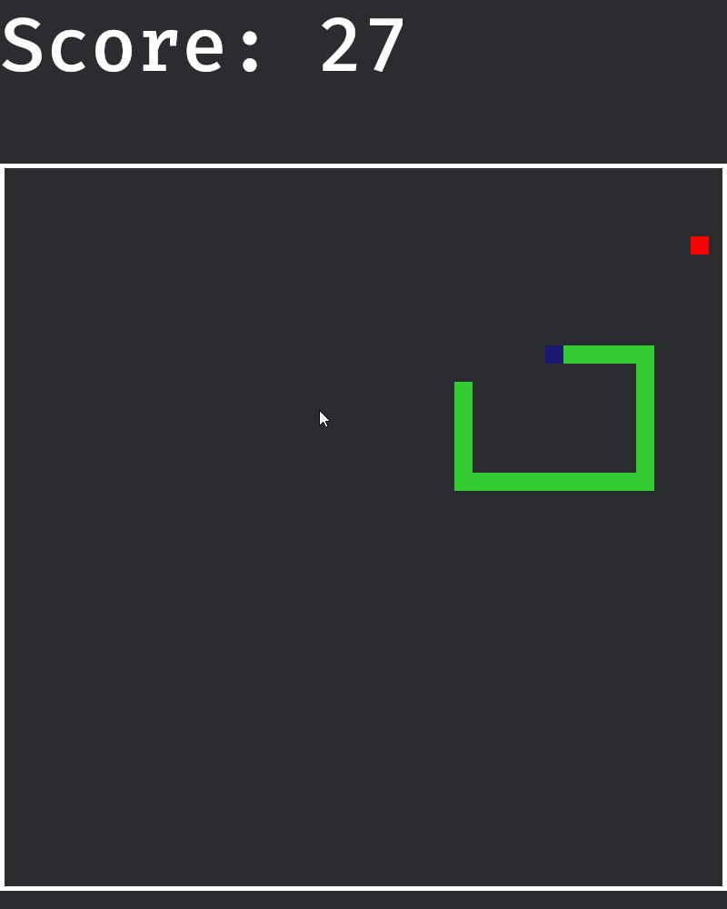

# snake

The snake game badly made in bevy.

<h1 align="center">
   
  🐍🐍
</h1>

## Mistakes ( that i will not fix )

- Not looking into how the SpriteBundle and Srites render images
  - The snake and apple sprites are anchored by the center ( Anchor::Center )
  - I did not know that the Sprite component allowed you to change where the sprite is anchored from ( Default is Anchor::Center. I wanted Anchor::TopLeft ).

- Not becoming familar with events before starting the project
  - Some systems query or change values in systems that they aren't directly related to.

- Game Development
- Writing bad code
- Not knowing what plugins are and how to use them
